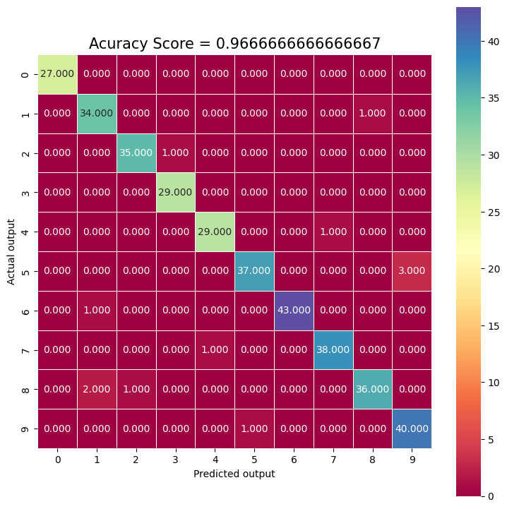
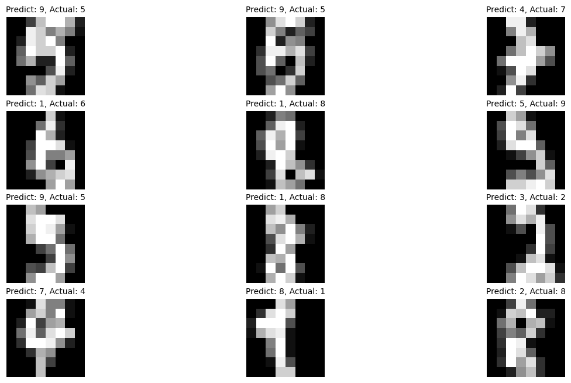

# **Logistic Regression And Image  Classification from Scratch**
>Import Libraries

```
import pandas as pd

import numpy as np

import matplotlib.pyplot as plt 
```

>Import Built in Dataset


```
#digit dataset
from sklearn.datasets import load_digits
digits = load_digits()
#input variabels or features
digits.data.shape
X= digits.data
#mean 1797 images and size is 64(8x8)
...(1437, 64)
```
>Plot the Figures
```
plt.figure(figsize=(20,4))
for index,(Image,label) in enumerate(zip(digits.data[0:5], digits.target[0:5])):
    plt.subplot(1,5, index + 1)
    plt.imshow(np.reshape(Image,(8,8)), cmap=plt.cm.gray)
    plt.title('Training: %i\n' % label, fontsize= 20)
```
>Split the data
```
from sklearn.model_selection import train_test_split
X_train, X_test, y_train, y_test= train_test_split(X,y,test_size=0.2,random_state=0  )
```
>Print Train and Test Shape
```
print("train input data :", X_train.shape)
print("train output data :", X_test.shape)
print("train input data :", y_train.shape)
print("train input data :", y_test.shape)
```
>Train The Model
```
from sklearn.linear_model import LogisticRegression
model = LogisticRegression().fit(X_train,y_train)
model
```
>Predict Your Model
```
model.predict(X_test[0:10])
predictions = model.predict(X_test)
predictions
```
>Acuraccy test
```
score = model.score(X_test,y_test)
print("the acuraccy score is :",score)
```
>Confusion matrix
```

from sklearn import metrics
cm = metrics.confusion_matrix(y_test, predictions)
cm
```
>Heat Map To see Confusion matrices
```
import seaborn as sns
plt.figure(figsize=(9,9))
sns.heatmap(cm,annot=True, fmt=".3f", linewidths=.5 , square= True, cmap= 'Spectral');
plt.ylabel('Actual output');
plt.xlabel('Predicted output');
all_sampel_title= 'Acuracy Score = {0}'.format(score)
plt.title(all_sampel_title,size=15);
```

>Or simply you can see your Confusion Matrices in that way
**print(cm)**

>>Now Getting miss classified labels
```
import numpy as np
import matplotlib.pyplot as plt
index = 0
misclasifiedindexes= []
for label, predict in zip(y_test,predictions):
    if label!= predict:
        misclasifiedindexes.append(index)
        index +=1
```
>You can use the **np.where** on the Boolean comparison between predictions and actuals.
```
#Plotting
import matplotlib.pyplot as plt
misclassifiedIndexes = np.where(y_test!=predictions)[0]


fig, ax = plt.subplots(4, 3,figsize=(15,8))
ax = ax.ravel()
for i, badIndex in enumerate(misclassifiedIndexes):
    ax[i].imshow(np.reshape(X_test[badIndex], (8, 8)), cmap=plt.cm.gray)
    ax[i].set_title(f'Predict: {predictions[badIndex]}, '
                    f'Actual: {y_test[badIndex]}', fontsize = 10)
    ax[i].set(frame_on=False)
    ax[i].axis('off')
plt.box(False)
plt.axis('off')
```

# >>>>>>>>>>>>>>>>>END>>>>>>>>>>>>>>>>
